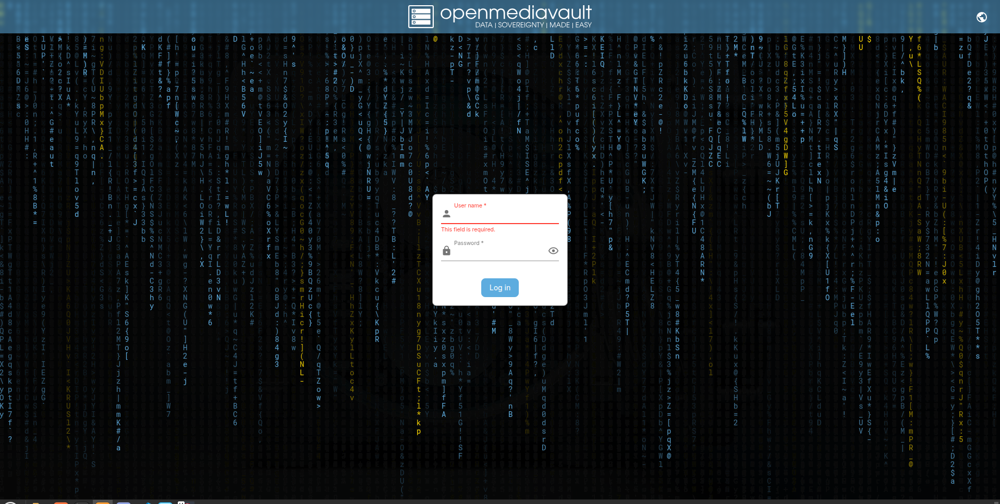
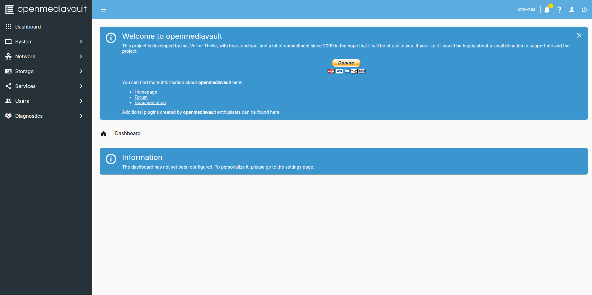
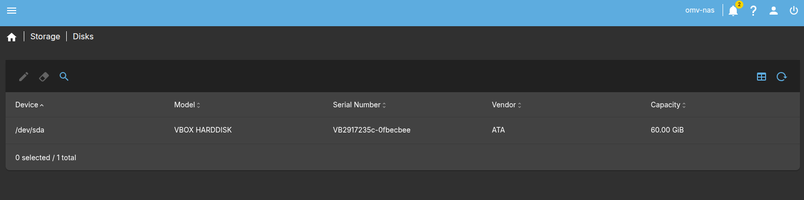
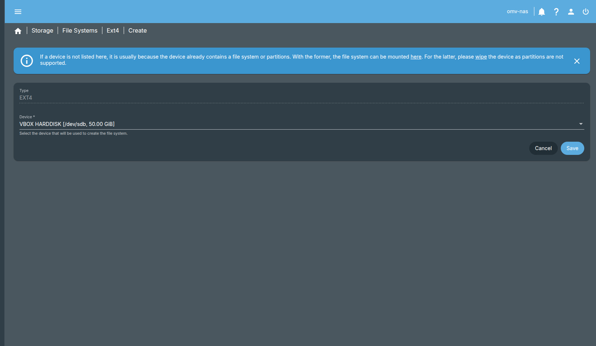
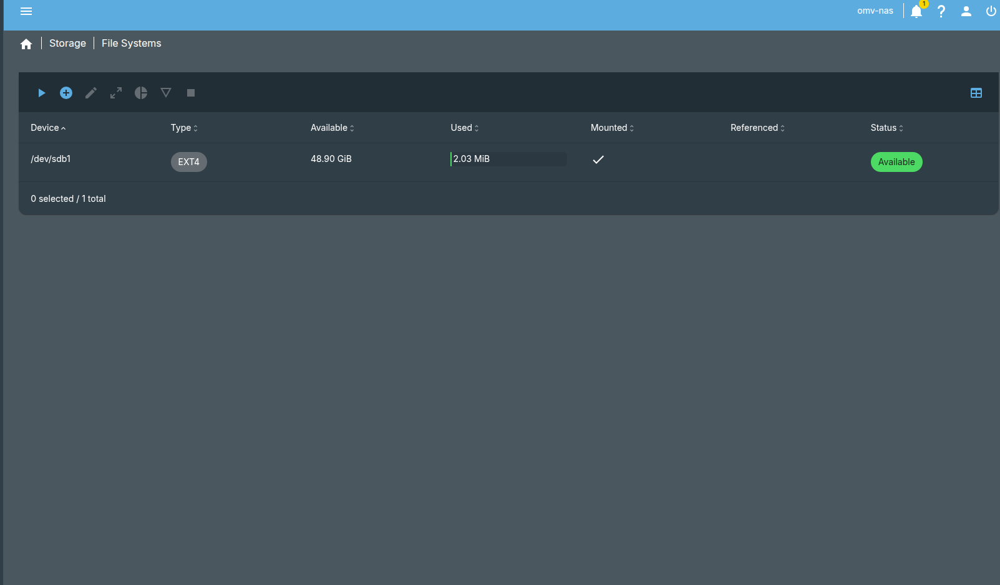
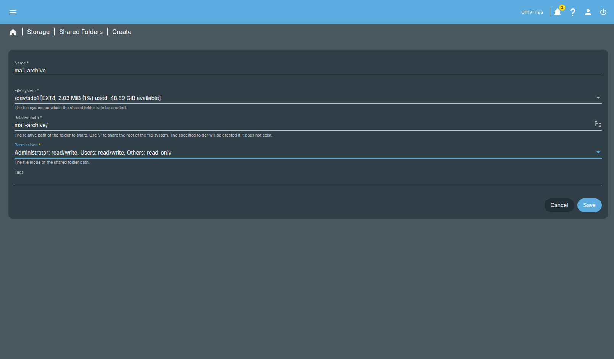

# email-nas-retention

When it comes to storage space allocation with emails and wanting to learn how to solve Gmail storage without mass deleting and wanting to save them, it is a good idea to build a NAS for it.

For this, it can be done with a Raspberry PI or OpenMediaVault in a VM  
OpenMediaVault download: https://www.openmediavault.org/download.html   
Download the stable version and go to VirtualBox

# VM Creation
In VirtualBox, click on new with these config:  
Name: OMV-NAS   
Type: Linux with Debian 64 Bit  
RAM MB: 4096    
VDI disk and dynamic    
Size of 60 GB   
Then set the network to bridged and attach the OMV iso. 

Then boot up the VM and go through the prompts that are straighforward and keep the domain blank.   
After waiting a few minutes:    
  
Take note of the the address and go to a browser and type it to access OMV like so: 
    
Then enter in the admin credentials to get in and see this: 
    

# OMV
Then go the user icon and select change password for omv-nas to something more secure.  
Then go to storage and click on disks to see if the disk for the system shows up:   

Make sure before hand to create a second disk instead so that can be seen and like so:  
    
Click on save and it will go the mount screen like below:   
    
Then go to Storage -> Shared Folders and create the folder like so with similar input: 
    
Hit save then hit configure and then go to Services -> SMB -> Shares and click on the dropdown in shares and see the shares creation and link the email-archive that was created and set to to guests-allowed. Then hit save and config.    
