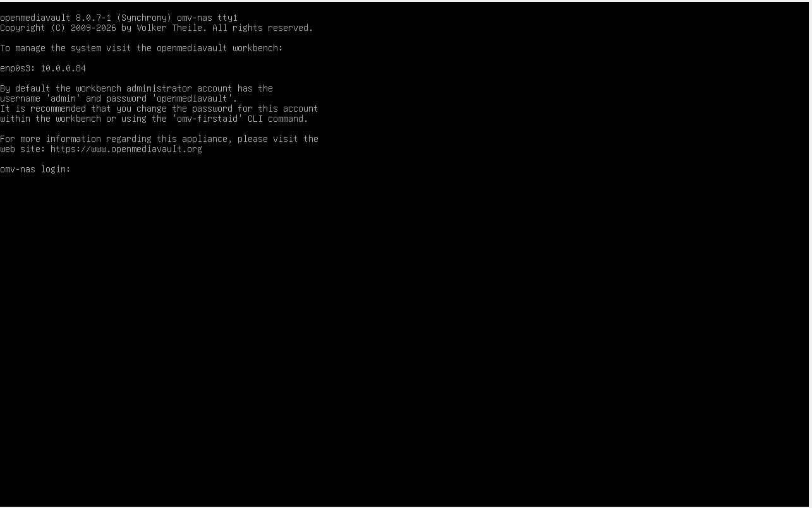

# email-nas-retention

When it comes to storage space allocation with emails and wanting to learn how to solve Gmail storage without mass deleting and wanting to save them, it is a good idea to build a NAS for it.

For this, it can be done with a Raspberry PI or OpenMediaVault in a VM  
OpenMediaVault download: https://www.openmediavault.org/download.html   
Download the stable version and go to VirtualBox

# VM Creation
In VirtualBox, click on new with these config:  
Name: OMV-NAS   
Type: Linux with Debian 64 Bit  
RAM MB: 4096    
VDI disk and dynamic    
Size of 60 GB   
Then set the network to bridged and attach the OMV iso. 

Then boot up the VM and go through the prompts that are straighforward and keep the domain blank.   
After waiting a few minutes:    
  
