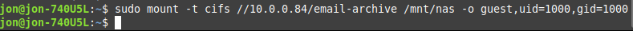
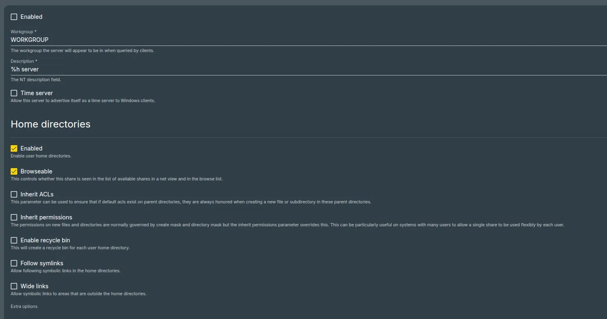
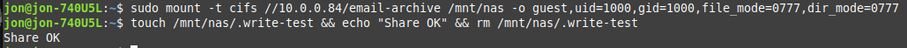
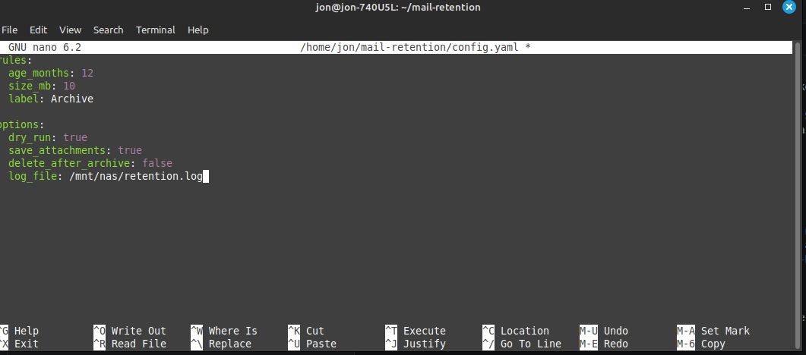
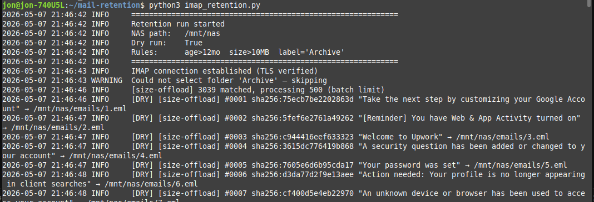
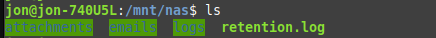
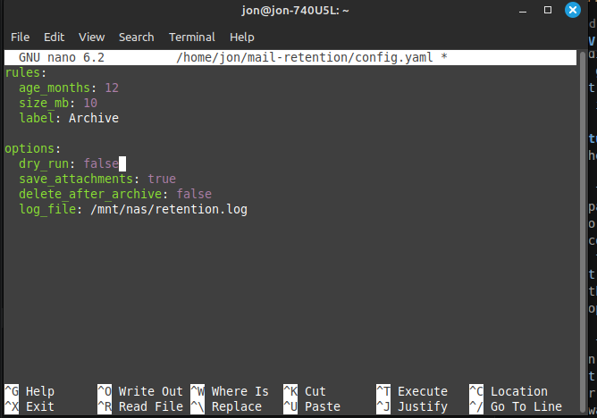
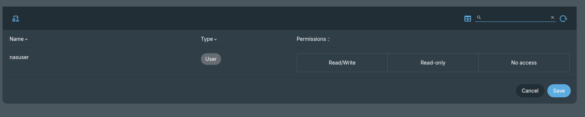
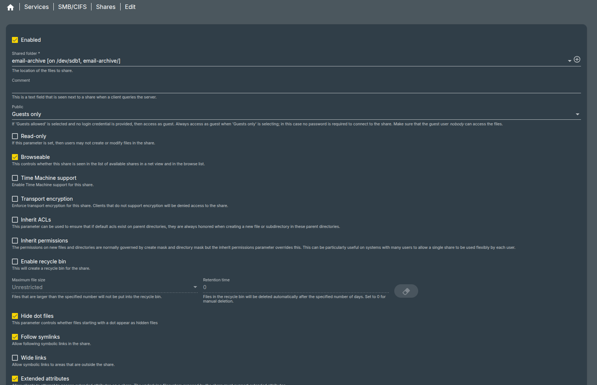
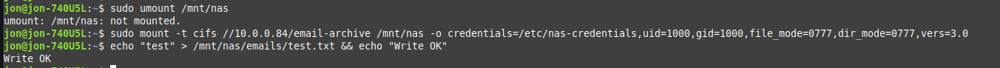

# email-nas-retention

When it comes to storage space allocation with emails and wanting to learn how to solve Gmail storage without mass deleting and wanting to save them, it is a good idea to build a NAS for it.

For this, it can be done with a Raspberry PI or OpenMediaVault in a VM  
OpenMediaVault download: https://www.openmediavault.org/download.html   
Download the stable version and go to VirtualBox

# VM Creation
In VirtualBox, click on new with these config:  
Name: OMV-NAS   
Type: Linux with Debian 64 Bit  
RAM MB: 4096    
VDI disk and dynamic    
Size of 60 GB   
Then set the network to bridged and attach the OMV iso. 

Then boot up the VM and go through the prompts that are straighforward and keep the domain blank.   
After waiting a few minutes:    
  
Take note of the the address and go to a browser and type it to access OMV like so: 
    
Then enter in the admin credentials to get in and see this: 
    

# OMV
Then go the user icon and select change password for omv-nas to something more secure.  
Then go to storage and click on disks to see if the disk for the system shows up:   

Make sure before hand to create a second disk instead so that can be seen and like so:  
    
Click on save and it will go the mount screen like below:   
    
Then go to Storage -> Shared Folders and create the folder like so with similar input: 
    
Hit save then hit configure and then go to Services -> SMB -> Shares and click on the dropdown in shares and see the shares creation and link the email-archive that was created and set to to guests-allowed. Then hit save and config.    
Then go the command line on host and write this command:    
    
Since it doesn't show anything, that means it worked.   
Backtracking a little bit but for this screen:  
    
Make sure the enabled at the very top is set it on or it will not work or error.    
Then go to the VM and login with root creds and type ls /srv/ and ip addr show to get the path and IP address of the OMV VM. Once so run chmod -R 777 /srv/dev-disk-by-uuid-c76de889-2fab-4dae-acae-c7f60e70078/email-archive.  
Then go to the Linux command host and run:  
    
When it says Share OK, the NAS is now mounted and time to move on to the next.  

# Setup
In the command line type mkdir ~/mail-retention then cd ~/mail-retention.   
Then run sudo apt install python3-pip, then run pip install pyyaml python-dotenv.   
Then type nano ~/mail-retention/.env which will open up a empty file for the gmail, app password and path for the nas. For the Gmail App password go to myaccount.google.com after enabling 2 factor and type in myaccount.google.com/apppasswords and click on create and name it something and copy and save the password generated.  
Then type nano ~/mail-retention/config.yaml to create a yaml file with these contents:  
   
For the line delete_after_archive: false means when set to false that the emails will basically be copied from Gmail to the NAS while true means they will be deleted and then stored on the NAS.   
Then type nano imap3_retention.py and enter in this code from the file, made with Claude, and run it in the mail-retention folder by running python3 imap_retention.py and seeing the start of it:  
   
After a few minutes, since it was set to run on 1,000 emails should see the message that the dry run was complete with several files created in it: 
   
Since this was a dry run it will not have wrote a .eml file and just logged to retention.log with the same output as when the command was run.  
For it to work fully, change the dry run option from true to false to set to a more live avenue. Additionally can modify the rules to be years such as date_from and date_to with "YYYY-MM-DD"  
With set false for dry_run:    
   
And run the imap.retention.py script    
But first go and create a seconday user account, in OMV go to System -> Users -> Add and name the user nasuser with password that doesn't have special characters in it. Then go to Storage -> Shared Folders and click on the folder permissions and add the nasuser with read/write like so:  
   
Then hit save and apply changes. Then go to Services -> SMB/CIFS -> Shares -> then click on email-archive and click on edit and change the Public option from Guests allowed to Guests only:    
   
Then in the command line and type sudo nano /etc/nas-credentials and enter in like this:    
username=yourusernameforsecondnasuser
password=passwordwithoutspecialcharacters   
Then save it and type sudo chmod 6000 /etc/nas-credentials. Then type this: 

